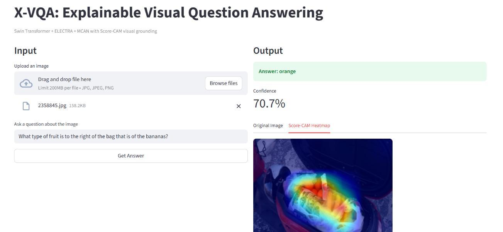
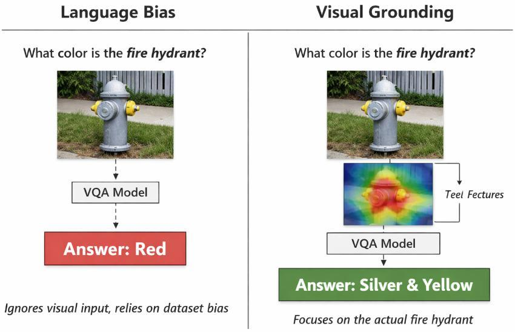
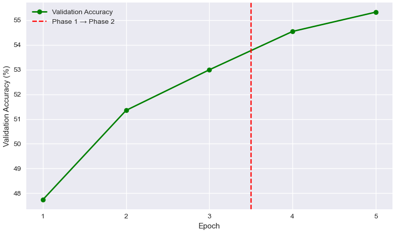
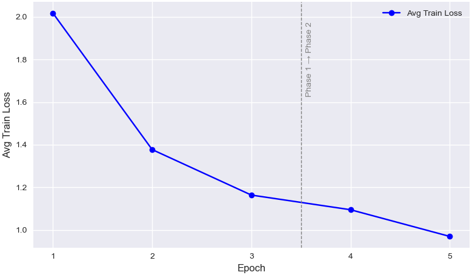
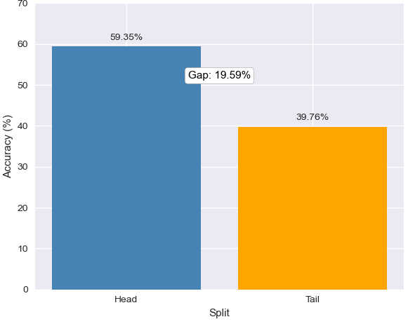
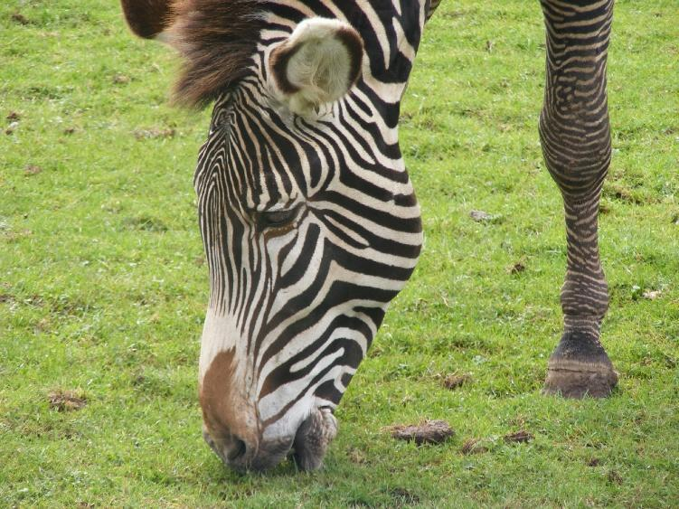
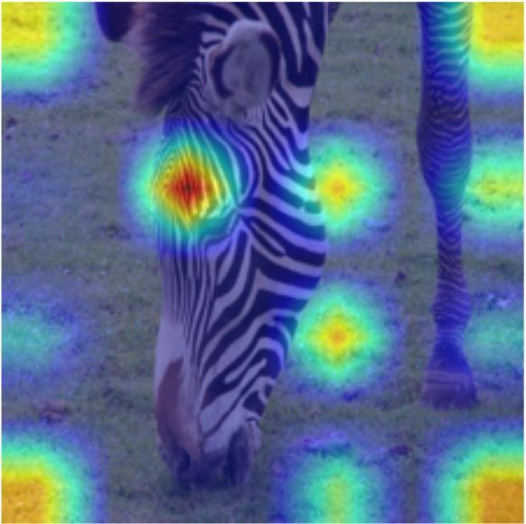
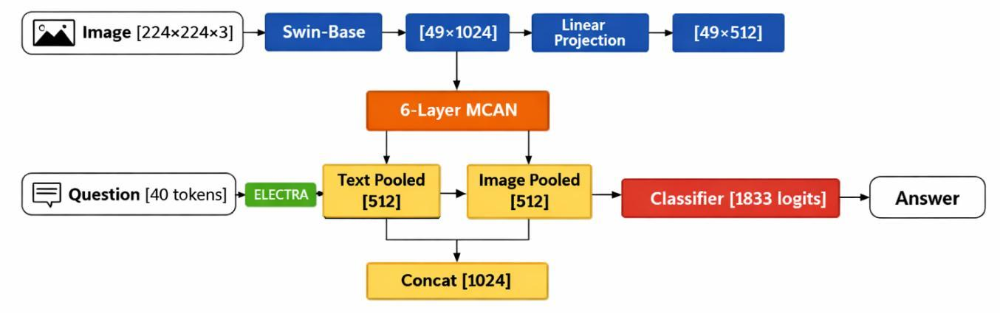
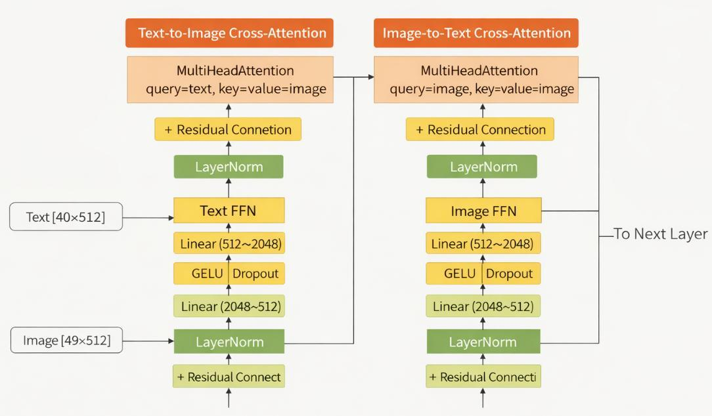
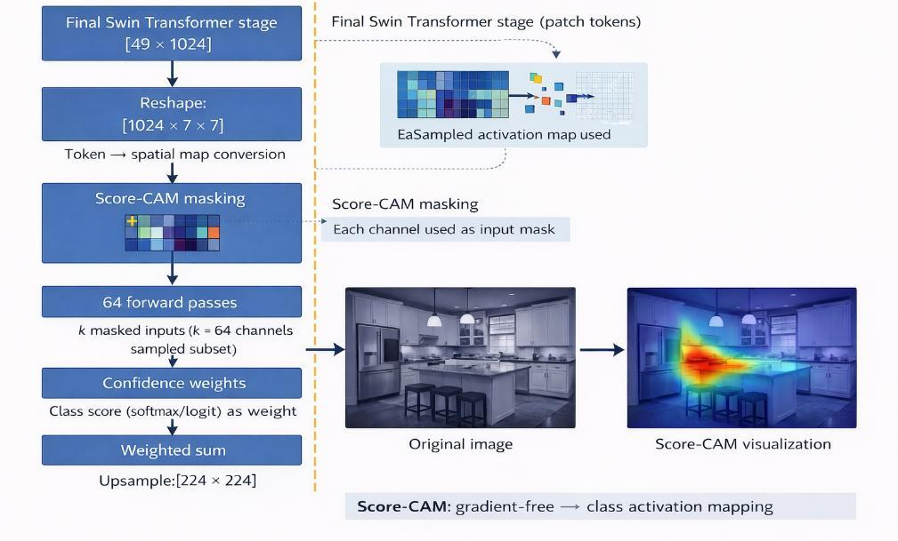

# X-VQA — Explainable Visual Question Answering

Answering free-form questions about images, and showing *where in the image* the answer came from.

X-VQA fuses a **Swin Transformer** visual encoder with an **ELECTRA** text encoder through a **6-layer bidirectional cross-attention network (MCAN)**, and attaches **Score-CAM** to the final Swin block so every prediction ships with a spatial attribution map. It is evaluated on **GQA-OOD** to quantify how much of its accuracy is genuine visual reasoning versus language-prior guessing.

<!-- Replace with your deployed URL once the Space is live -->
[](https://huggingface.co/spaces/YOUR_USERNAME/xvqa)




> *"What type of fruit is to the right of the bag that is of the bananas?"* → **orange** (70.7% confidence). The heatmap confirms the model localized the oranges rather than guessing from the word "fruit".

---

## Why this project

Most VQA models are right for the wrong reasons. Asked *"what color is the fire hydrant?"*, a model trained on a biased corpus answers from the statistics of its training set rather than from the pixels — and it gives the same answer whatever the image shows. This is the Clever Hans failure mode, and standard accuracy metrics are blind to it.



X-VQA attacks the problem from two directions:

1. **Measure the bias.** Evaluate on GQA-OOD, which splits the validation set into *Head* (answers matching frequent statistical associations) and *Tail* (rare or counterintuitive answers where linguistic shortcuts actively mislead). The Head–Tail gap is a direct readout of how much the model leans on priors.
2. **Expose the reasoning.** Score-CAM produces gradient-free spatial attributions from the Swin activation space, so you can inspect whether the model looked at the right region before trusting its answer.

---

## Results

Trained on the GQA balanced split (943K questions, ~72K images) for 5 epochs on a single A100.

### Training

| Epoch | Phase | Avg train loss | Val accuracy |
|:-----:|:------|:--------------:|:------------:|
| 1 | Frozen encoders | 2.0173 | 47.74% |
| 2 | Frozen encoders | 1.3773 | 51.35% |
| 3 | Frozen encoders | 1.1638 | 52.99% |
| 4 | Full fine-tune | 1.0950 | 54.54% |
| 5 | Full fine-tune | 0.9698 | **55.32%** |

<p align="center">
  
  
</p>

Two-phase training: the fusion layers stabilize against frozen encoders for 3 epochs (+5.25 pp), then everything unfreezes with differential learning rates (+2.33 pp). The dashed line marks the phase transition — no accuracy drop across it, which is what gradient clipping at 1.0 plus cosine warmup bought. Accuracy was still climbing at epoch 5.

### Bias evaluation (GQA-OOD)

| Split | Questions | Skipped (OOV) | Accuracy |
|:------|----------:|--------------:|---------:|
| Head | 33,882 | 0 | 59.35% |
| Tail | 17,163 | 2 | 39.76% |
| **Gap** | — | — | **19.59 pp** |

<p align="center">
  
</p>

The 19.59 pp gap is the honest finding: X-VQA has learned real statistical associations, as every model trained on a finite corpus does. But Tail accuracy of 39.76% on a **1,833-way** classification problem — where chance is ~0.05% — means the model is genuinely reasoning over visual evidence on a large fraction of rare concept pairings, not defaulting to frequency priors.

### Visual grounding

<p align="center">
  
  
</p>

*"Is there a red chair in the room?"* → **no**. A language-biased model that had learned to associate "red chair" questions with "yes" would answer incorrectly here. The correct answer requires actually looking and finding neither a room nor a chair — and the heatmap shows attention concentrated on the zebra and surrounding grass, which is the evidence that produced the "no".

### Against published baselines

| Model | GQA val acc | Image encoder | VL pretraining data | Explainability |
|:------|:-----------:|:--------------|:--------------------|:---------------|
| CNN-LSTM baseline | ~35% | ResNet | ImageNet only | None |
| Bottom-Up Attention | ~49% | Faster R-CNN | ImageNet + COCO | None |
| LXMERT | ~60% | ResNet + RoI | 180M image-text pairs | None |
| Oscar | ~61% | Faster R-CNN | 6.5M image-text pairs | None |
| **X-VQA (this work)** | **55.32%** | Swin-Base | **None** (ImageNet + text only) | **Score-CAM** |

X-VQA lands ~5 pp below the large-scale pretraining models while using **zero** vision-language pretraining pairs — and it is the only model in the comparison that emits a spatial explanation for every prediction.

---

## Architecture



| Component | Module | In → Out | Params |
|:----------|:-------|:---------|-------:|
| Vision encoder | Swin-Base (patch4, window7, 224) | 224×224×3 → 49×1024 | ~88M |
| Text encoder | ELECTRA-Base discriminator | 40 tokens → 40×768 | ~110M |
| Vision projection | Linear | 1024 → 512 | 0.5M |
| Text projection | Linear | 768 → 512 | 0.4M |
| Fusion | MCAN × 6 layers | 512 → 512 | ~75M |
| Classifier | MLP + GELU + Dropout(0.3) | 1024 → 1833 | ~2M |
| **Total** | | | **~276M** |

### Inside one MCAN layer

<p align="center">
  
</p>

Each layer runs **bidirectional** cross-attention — text queries image, image queries text, 8 heads each — followed by per-modality FFNs (512→2048→512), all with residual connections and LayerNorm. Six stacked layers let each modality progressively refine its representation against the other. After the stack, both streams are mean-pooled and concatenated into a 1024-d joint vector for classification.

### Making Score-CAM work on a multimodal transformer

<p align="center">
  
</p>

Score-CAM assumes a single-input, CNN-shaped model. Three adaptations were required:

- **Two inputs.** `XVQACamWrapper` freezes the tokenized question and exposes only `pixel_values` as the variable input, so Score-CAM's masking mechanism has a single tensor to perturb.
- **Dynamic batch expansion.** Score-CAM pushes up to 64 masked copies of the image through the model per call. The wrapper expands `input_ids` and `attention_mask` to `pixel_values.shape[0]` on every forward pass — this is what prevents a shape mismatch inside the MCAN attention layers.
- **Token → spatial reshape.** Swin emits `[batch, 49, 1024]` sequences, not feature maps. `swin_reshape_transform` folds the 49-token sequence into a 7×7 grid and transposes to `[batch, 1024, 7, 7]`, which Score-CAM upsamples to 224×224 for overlay.

Hooks are registered on `model.vision_encoder.encoder.layers[-1].blocks[-1].layernorm_before`.

---

## Training strategy

| Hyperparameter | Phase 1 (epochs 1–3) | Phase 2 (epochs 4–5) |
|:---------------|:---------------------|:---------------------|
| Encoders | Frozen | Unfrozen |
| Optimizer | AdamW | AdamW |
| Learning rate | 1e-4 uniform | Differential (below) |
| Weight decay | 0.01 | 0.01 |
| Schedule | Cosine + 10% warmup | Cosine + 10% warmup |
| Batch size | 32 | 32 |
| Grad clipping | 1.0 | 1.0 |

Phase 2 differential learning rates: **5e-6** for the Swin and ELECTRA encoders (preserve pretrained representations), **1e-5** for the projections, MCAN, and classifier.

---

## Quickstart

```bash
git clone https://github.com/YOUR_USERNAME/xvqa-explainable-vqa.git
cd xvqa-explainable-vqa

python -m venv .venv && source .venv/bin/activate   # Windows: .venv\Scripts\activate
pip install -r requirements.txt

python download_weights.py     # fetches best_model.pth (~1.1 GB) from Releases
streamlit run app.py
```

Opens at `http://localhost:8501`. Upload an image, type a question, get an answer with confidence and a Score-CAM heatmap.

> **On CPU:** inference takes a few seconds, but Score-CAM needs 64 forward passes through a 276M-parameter model and takes 1–3 minutes. The sidebar toggle lets you skip it.

### Reproducing training

Open [`notebooks/XVQA_training_and_evaluation.ipynb`](notebooks/XVQA_training_and_evaluation.ipynb) in Colab (A100 recommended). It covers the full pipeline: GQA download, dataset/dataloader construction, two-phase training, GQA-OOD Head/Tail evaluation, and Score-CAM generation.

External data required (not in this repo):

| Asset | Source |
|:------|:-------|
| GQA images (~20 GB) | `https://downloads.cs.stanford.edu/nlp/data/gqa/images.zip` |
| GQA questions 1.2 | [GQA dataset page](https://cs.stanford.edu/people/dorarad/gqa/download.html) |
| GQA scene graphs | [GQA dataset page](https://cs.stanford.edu/people/dorarad/gqa/download.html) |
| GQA-OOD splits | [gqa-ood repository](https://github.com/gqa-ood/GQA-OOD) |

---

## Repository layout

```
├── app.py                    # Streamlit inference dashboard
├── model_def.py              # XVQAModel, MCAN, Score-CAM wrapper + reshape transform
├── download_weights.py       # Pulls the checkpoint from GitHub Releases
├── answer_to_id.json         # 1,833-answer vocabulary
├── requirements.txt
├── notebooks/
│   └── XVQA_training_and_evaluation.ipynb
├── docs/
│   └── XVQA_Project_Report.pdf
└── assets/                   # Figures from the report
```

---

## Limitations

- **Closed vocabulary.** Answers are restricted to the 1,833 classes seen in GQA training. Out-of-vocabulary answers are unreachable by construction.
- **Residual language bias.** The 19.59 pp Head–Tail gap is real. Debiasing objectives (LMH, RUBi) were not applied.
- **Under-trained.** Validation accuracy was still rising at epoch 5; the run was stopped on compute budget, not convergence.
- **Score-CAM cost.** 64 forward passes per explanation makes it impractical for real-time or batch use.
- **Explanations are visual only.** The heatmap shows *where*, not *why* — there is no textual rationale.

## Future work

Extend training past 5 epochs; add an explicit debiasing loss and re-measure the Head–Tail gap; extract MCAN cross-attention weights for a lighter-weight explanation than Score-CAM; benchmark on VQA-CP v2 for a second bias measurement.

---

## References

1. Hudson & Manning. *GQA: A New Dataset for Real-World Visual Reasoning and Compositional Question Answering.* CVPR 2019.
2. Kervadec et al. *Roses are Red, Violets are Blue… But Should VQA Expect Them To?* (GQA-OOD) CVPR 2021.
3. Liu et al. *Swin Transformer: Hierarchical Vision Transformer using Shifted Windows.* ICCV 2021.
4. Clark et al. *ELECTRA: Pre-training Text Encoders as Discriminators Rather Than Generators.* ICLR 2020.
5. Yu et al. *Deep Modular Co-Attention Networks for Visual Question Answering.* CVPR 2019.
6. Wang et al. *Score-CAM: Score-Weighted Visual Explanations for Convolutional Neural Networks.* CVPRW 2020.

## License

MIT — see [LICENSE](LICENSE). GQA and GQA-OOD carry their own licenses; the pretrained backbones follow their respective Hugging Face model card terms.

---

Built by **Vishal Agarwal** · Full write-up in [`docs/XVQA_Project_Report.pdf`](docs/XVQA_Project_Report.pdf)
